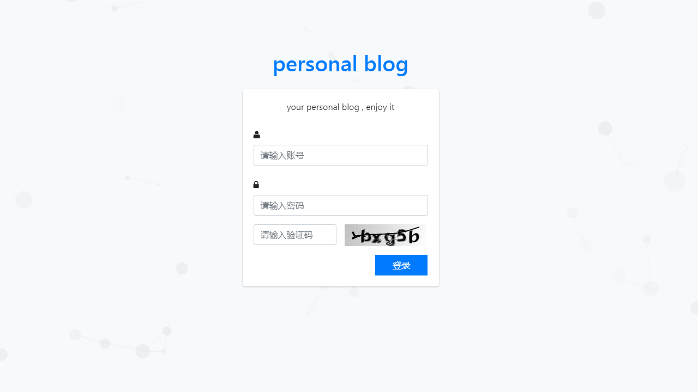
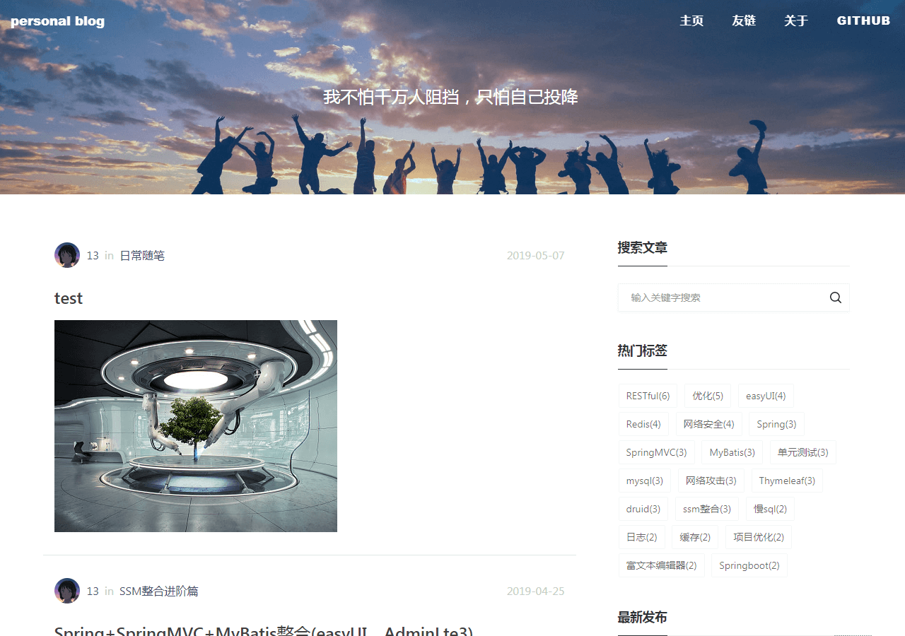

## 效果预览

### 后台管理页面

- 登录页

  

- 后台首页

  

- 文章管理

  

- 文章编辑

  

- 评论管理

  

- 系统配置

  

### 博客展示页面

开发时，在项目中**内置了三套博客主题模板，主题风格各有千秋**，效果如下：

#### 模板一

- 首页

  

- 文章浏览

  

- 友情链接

  

#### 模板二

- 首页

  

- 文章浏览

  

- 友情链接

  

#### 模板三

- 首页

  

- 文章浏览

  

- 友情链接

  

## 数据库表

- tb_admin_user            用户表
- tb_ blog                       博客表
- tb_blog_category        博客目录表
- tb_blog_comment       博客评论表
- tb_blog_tag                 侧边栏标签表
- tb_blog_tag_relation   侧边栏标签对应博客表
- tb_config                     footer等信息
- tb_link                         友链表
- tb_test
- jdbc_test
- generator_test

## 知识点总结

博客系统涉及到的后端技术栈如下：

- Spring Boot
- MyBatis
- Thymeleaf
- kaptcha

博客系统涉及到的前端技术栈如下：

- AdminLTE3
- BootStrap
- JqGrid
- ajax
- Editor.md

## 功能模块

后台管理系统中包含如下模块：管理员登录、身份认证、菜单设置、博客管理、文件上传及管理、markdown 文章编辑器整合、分类管理、标签管理、友链管理、评论管理、系统设置、数据统计及常用的交互功能，而前台网站则包括：博客首页、博客搜索、博客浏览、博客评论、友链展示等功能模块。

